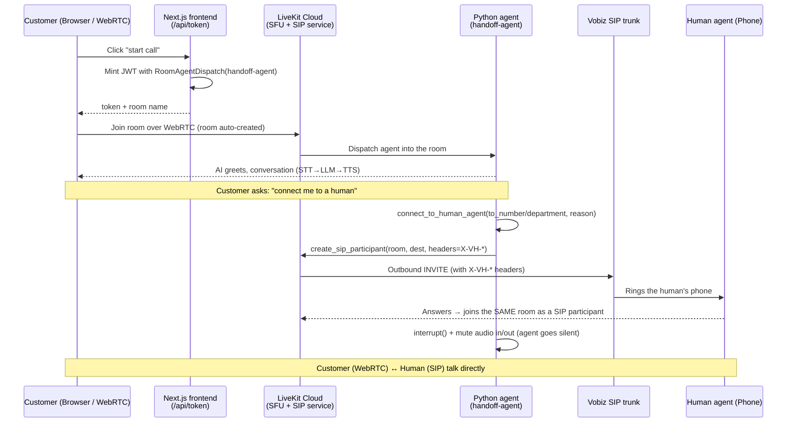

# LiveKit WebRTC → Human Handoff

Transfer a **WebRTC voice call** from an AI agent to a **human on a phone** — by *dialing
the human into the same LiveKit room*, not by SIP REFER. Built on
[LiveKit Agents](https://github.com/livekit/agents) (Python) + the
[`agent-starter-react`](https://github.com/livekit-examples/agent-starter-react) WebRTC
frontend, with a [Vobiz](https://vobiz.ai) SIP trunk for the telephony leg.

> A customer talks to an AI in the browser. When they ask for a human, the AI places an
> outbound phone call **into the existing room** and then goes silent. The customer
> (browser/WebRTC) and the human (phone/SIP) talk directly, with the human's call screen
> pre-briefed via **custom SIP headers**.

---

## Table of contents
- [Architecture](#architecture)
- [How a handoff works, step by step](#how-a-handoff-works-step-by-step)
- [Repository layout](#repository-layout)
- [Prerequisites](#prerequisites)
- [Setup](#setup)
- [Running it](#running-it)
- [Features](#features)
- [SIP headers (briefing the human)](#sip-headers-briefing-the-human)
- [Configuration reference](#configuration-reference)
- [Mapping to production (Ameyo overflow)](#mapping-to-production-ameyo-overflow)
- [Further docs](#further-docs)
- [Security notes](#security-notes)

---

## Architecture



**Components**

| Layer | Tech | Role |
|---|---|---|
| Customer client | `agent-starter-react` (Next.js + livekit-client) | Real WebRTC voice UI; mints the join token |
| Media plane | LiveKit Cloud SFU | Routes/mixes audio between all participants |
| AI agent | LiveKit Agents (Python) | STT→LLM→TTS, owns the `connect_to_human_agent` tool |
| Telephony | LiveKit SIP service → Vobiz trunk | Places the outbound call that adds the human |
| Human | Any phone / SIP softphone (Ameyo in prod) | Joins the room as a SIP participant |

---

## How a handoff works, step by step

1. **Room is created by the customer joining.** The frontend's `/api/token` route mints a
   JWT whose `RoomConfiguration` embeds `RoomAgentDispatch(agent_name="handoff-agent")`.
   When the customer joins over WebRTC, LiveKit **auto-creates the room** and **dispatches
   the Python agent into it**. Room now holds: `[customer] + [AI]`.
2. **Conversation.** `AgentSession` runs Deepgram STT → OpenAI LLM → OpenAI/Cartesia TTS.
3. **Trigger.** The customer asks for a human. The LLM calls the
   `connect_to_human_agent` tool (optionally with `to_number`, `department`, `reason`).
4. **Dial into the *same* room.** The tool calls `create_sip_participant` with the
   **existing** `room_name` and the resolved destination, attaching `X-VH-*` SIP headers.
   `wait_until_answered=True` blocks until the human picks up.
5. **Human joins.** LiveKit's SIP service places the outbound call via the Vobiz trunk;
   on answer, the human becomes a participant **in that same room**. No new room.
6. **AI goes silent.** The agent calls `interrupt()` then
   `output.set_audio_enabled(False)` + `input.set_audio_enabled(False)` — it stops
   speaking *and* listening, so the customer and human talk directly with the agent adding
   no audio or CPU load. (Or, with `STEP_AWAY=true`, the agent disconnects entirely; the
   room survives because `close_on_disconnect=False`.)

> **Key takeaway:** the room exists *first* (created the moment the customer joins); the
> human is *added* to it via an outbound SIP call. The transfer never creates a second room.

See [`docs/ARCHITECTURE.md`](docs/ARCHITECTURE.md) for the deep dive (audio mixing, dispatch,
mute internals).

---

## Repository layout

```
LiveKit-WebRTC-Handoff/
├── agent.py               # Python AI agent + connect_to_human_agent handoff tool
├── requirements.txt       # Python deps (livekit-agents, plugins, ...)
├── .env.example           # backend config template (copy to .env)
├── frontend/              # agent-starter-react — the customer's WebRTC UI
│   ├── app/api/token/     # mints the join token w/ agent dispatch
│   └── .env.example       # frontend config template (copy to .env.local)
└── docs/
    ├── TELEPHONY-SETUP.md  # create the Vobiz SIP trunk → OUTBOUND_TRUNK_ID (do this first)
    ├── ARCHITECTURE.md     # how room/dispatch/audio-mixing/mute work
    ├── SIP-HEADERS.md      # how X-VH-* headers are sent & populated
    ├── WEBHOOKS.md         # Vobiz trunk webhooks (CallInitiated/Hangup, MOS/jitter)
    └── TROUBLESHOOTING.md  # common issues + fixes
```

---

## Prerequisites

- **Python 3.11+** and **Node 18+** (Node 22 tested)
- A **LiveKit Cloud** project (URL + API key/secret)
- **OpenAI** and **Deepgram** API keys
- A **Vobiz SIP trunk** registered as a **LiveKit outbound SIP trunk** — this gives you the
  `OUTBOUND_TRUNK_ID` (`ST_…`). **Set this up first:** see
  **[docs/TELEPHONY-SETUP.md](docs/TELEPHONY-SETUP.md)**, which references the
  [vobiz-ai/LiveKit-Vobiz-Outbound](https://github.com/vobiz-ai/LiveKit-Vobiz-Outbound) repo.
- A phone number to receive the transfer (your mobile works for testing)

---

## Setup

**0. Telephony (do this first).** Create the Vobiz outbound SIP trunk in LiveKit to get your
`OUTBOUND_TRUNK_ID` and `VOBIZ_*` values — full walkthrough (CLI + Python) in
**[docs/TELEPHONY-SETUP.md](docs/TELEPHONY-SETUP.md)**. Without a working trunk, the agent
can greet over WebRTC but cannot dial a human.

**1. Backend (Python agent)**
```bash
cp .env.example .env          # then fill in real values (incl. OUTBOUND_TRUNK_ID + VOBIZ_*)
python3 -m venv .venv
.venv/bin/pip install -r requirements.txt
```

**2. Frontend (WebRTC client)**
```bash
cd frontend
cp .env.example .env.local    # then fill in LiveKit creds + AGENT_NAME
npm install
```

In `frontend/.env.local` set:
```env
LIVEKIT_URL=wss://<your-project>.livekit.cloud
LIVEKIT_API_KEY=<key>
LIVEKIT_API_SECRET=<secret>
AGENT_NAME=handoff-agent       # MUST match agent.py's WorkerOptions(agent_name=...)
```
`AGENT_NAME` is what makes the browser's token embed the agent dispatch (explicit
dispatch). If you leave it blank, you'd instead need an agent that auto-dispatches.

---

## Running it

Two terminals:

```bash
# Terminal 1 — Python agent worker
.venv/bin/python agent.py dev

# Terminal 2 — frontend
cd frontend && npm run dev          # http://localhost:3000
```

Open <http://localhost:3000>, start the call, grant mic access. You're the **customer** on
a real WebRTC leg. Say **"connect me to a human"** → the agent dials
`DEFAULT_TRANSFER_NUMBER`, that phone rings, you answer → browser + phone are in the same
call. Try **"transfer me to +9199…"** or **"I need billing"** for the other routing modes.

---

## Features

| Feature | How |
|---|---|
| **Additive handoff (no REFER)** | `create_sip_participant` adds the human to the live room |
| **Transfer to any number** | tool arg `to_number` (E.164, validated) |
| **Department routing** | tool arg `department` → `TRANSFER_SALES/BILLING/SUPPORT` env |
| **Brief the human** | `X-VH-*` SIP headers (assistant, room, customer, reason) |
| **AI auto-mute on handoff** | `interrupt()` + disable audio in/out — not a prompt |
| **Warm vs. drop-off** | `STEP_AWAY=false` (AI stays muted) / `true` (AI leaves) |
| **Room survives AI leaving** | `close_on_disconnect=False` |
| **Swappable TTS** | `TTS_PROVIDER=openai|cartesia` |

> **Warm transfer (two-session pattern).** This project does a single-room handoff (the human
> joins the live room and the AI mutes). For a true *warm* transfer — where a second agent
> briefs the human in a **private consultation room** before the caller is connected — follow
> LiveKit's official pattern, which uses **two sessions/rooms**:
> **<https://docs.livekit.io/telephony/features/transfers/warm/>**

---

## SIP headers (briefing the human)

When the agent dials the human, it attaches **custom SIP headers** to the outbound INVITE
so the receiving system can screen-pop context. From `agent.py`:

```python
headers = {
    "X-VH-Assistant": "Vobiz-AI-Assistant",
    "X-VH-Source":    "webrtc-handoff",
    "X-VH-Room":      room_name,          # the LiveKit room
    "X-VH-Customer":  customer_identity,  # who the agent was talking to
    "X-VH-Department": department,        # if provided
    "X-VH-Reason":     reason,            # one-line brief written by the LLM
}
await ctx.api.sip.create_sip_participant(
    api.CreateSIPParticipantRequest(
        ..., headers=headers, include_headers=sip_protocol.SIP_X_HEADERS,
    )
)
```

**Three rules:**
1. **Prefix every header with `X-VH-`** — Vobiz forwards only `X-VH-*` and drops the rest.
2. **Short, single-line, ASCII values** (the tool sanitizes + truncates to ≤200 chars).
   Put summaries here; send long data over a webhook/DB keyed by `X-VH-Room`.
3. **A raw mobile won't display headers** — they're consumed by a **SIP endpoint** (e.g.
   Ameyo), which reads them and shows the human a screen-pop.

Full explanation of how each value is populated and read: [`docs/SIP-HEADERS.md`](docs/SIP-HEADERS.md).

---

## Configuration reference

### Backend `.env`
| Var | Purpose |
|---|---|
| `LIVEKIT_URL` / `LIVEKIT_API_KEY` / `LIVEKIT_API_SECRET` | LiveKit Cloud project |
| `OPENAI_API_KEY`, `DEEPGRAM_API_KEY` | LLM/TTS, STT |
| `TTS_PROVIDER`, `OPENAI_TTS_*`, `OPENAI_LLM_MODEL` | speech config |
| `OUTBOUND_TRUNK_ID` | LiveKit SIP outbound trunk (Vobiz) used to dial the human |
| `VOBIZ_*` | trunk auth + caller-ID |
| `DEFAULT_TRANSFER_NUMBER`, `TRANSFER_SALES/BILLING/SUPPORT` | human destinations |
| `STEP_AWAY` | `false` = AI stays muted, `true` = AI disconnects after handoff |

### Frontend `.env.local`
| Var | Purpose |
|---|---|
| `LIVEKIT_URL` / `LIVEKIT_API_KEY` / `LIVEKIT_API_SECRET` | same project as backend |
| `AGENT_NAME` | `handoff-agent` — drives explicit agent dispatch in the join token |

---

## Mapping to production (Ameyo overflow)

This demo dials *your phone*. For the real deployment, the only thing that changes is the
**destination**: point `DEFAULT_TRANSFER_NUMBER` (or `to_number`) at the **Ameyo** queue /
SIP endpoint. The agent dials Ameyo into the room; Ameyo routes to a free human and reads
the `X-VH-*` headers for a screen-pop. Same additive mechanism, same code — only the number
and the receiving system change. (Inbound-overflow variant: have Ameyo forward unanswered
calls *to* the agent instead; that path is real SIP and *can* use REFER.)

---

## Further docs
- [`docs/TELEPHONY-SETUP.md`](docs/TELEPHONY-SETUP.md) — create the Vobiz SIP trunk in LiveKit (do this first); refs [LiveKit-Vobiz-Outbound](https://github.com/vobiz-ai/LiveKit-Vobiz-Outbound)
- [`docs/ARCHITECTURE.md`](docs/ARCHITECTURE.md) — room/dispatch/audio-mixing/mute internals
- [`docs/SIP-HEADERS.md`](docs/SIP-HEADERS.md) — how headers are sent and populated end-to-end
- [`docs/WEBHOOKS.md`](docs/WEBHOOKS.md) — Vobiz trunk webhooks for call events + quality (MOS/jitter)
- [`docs/TROUBLESHOOTING.md`](docs/TROUBLESHOOTING.md) — agent kept talking, bad audio, dial failed, etc.
- [LiveKit warm transfers](https://docs.livekit.io/telephony/features/transfers/warm/) — official two-session pattern (consultation room → brief the human → connect the caller)

---

## Security notes
- **Never commit `.env` / `frontend/.env.local`** — they're gitignored. Use the
  `.env.example` templates. Rotate any key that has been committed.
- The frontend `/api/token` route is **dev-only** and refuses to run in production without
  an auth layer — add authentication before deploying.
- **Toll-fraud:** letting the LLM dial arbitrary `to_number`s is a cost risk. For
  production, whitelist destinations or allow only `department` keys.

## License
MIT (matches the upstream `agent-starter-react` template).
